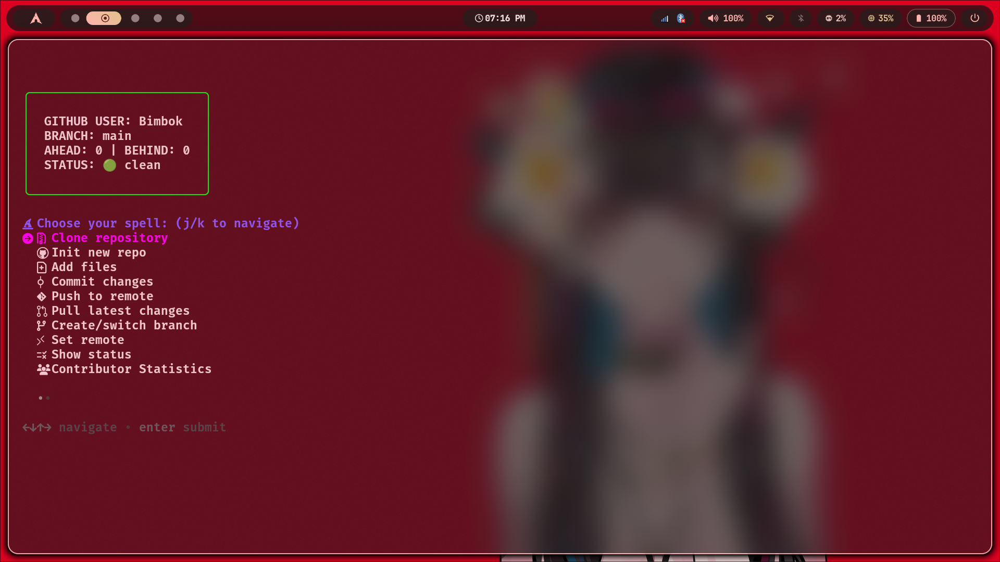
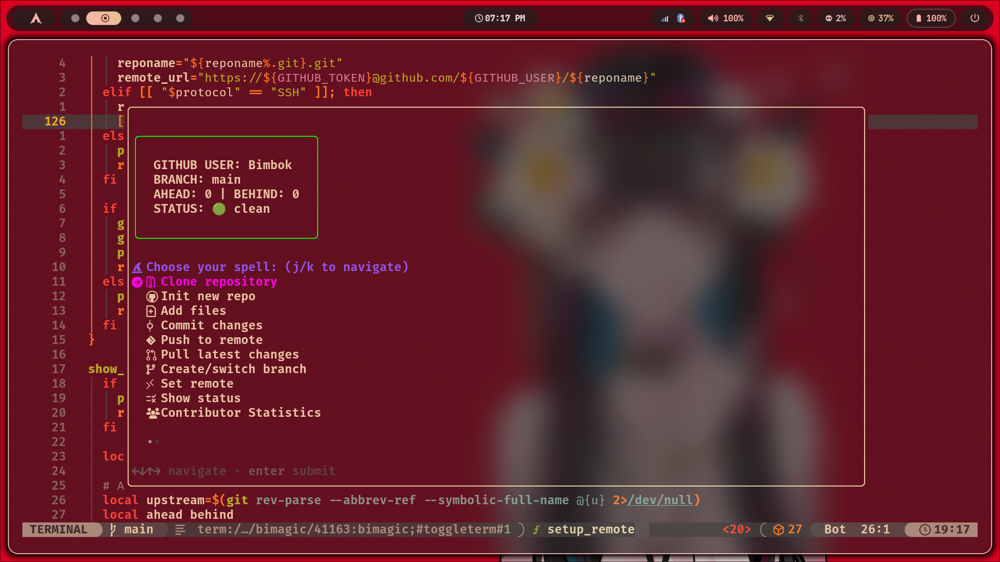

# Bimagic - The Go-Powered Git Wizard

<p align="center">
  
</p>

<p align="center">By Bimbok and adityapaul26</p>

A lightning-fast, Go-based Git automation tool that simplifies your GitHub workflow with an interactive magic menu.

## Overview

Bimagic is a powerful interactive command-line tool rewritten in **Go** for maximum performance and reliability. It streamlines common Git operations, making version control more accessible through a user-friendly menu interface. It handles repository initialization, committing, branching, and remote operations with GitHub integration using personal access tokens.

## Sample


<p align="center">bimagic in a terminal (kitty)</p>


<p align="center">bimagic in neovim</p>

## Features

- 🔮 **Interactive Magic Menu**: Driven by `gum` for a modern, fluid UI.
- 🔐 **Secure GitHub Auth**: Integration via personal access tokens.
- 📦 **Instant Initialization**: Setup new repositories with auto-renaming (`master` → `main`).
- 📥 **Smart Cloning**: Standard or Interactive selection (Sparse Checkout).
- 📊 **Themed Progress Bar**: Real-time visual feedback for cloning operations.
- 🗜️ **Shallow Clone Support**: Use `--depth` for lightweight clones.
- 🔄 **Simplified Remote Ops**: Effortless push/pull management.
- 🌿 **Branch Mastery**: Easy creation and switching between branches.
- 📊 **Status Dashboard**: Live view of ahead/behind counts, branch state, and conflicts.
- 🛡️ **Safe File Management**: Intelligent file/folder removal with Git integration.
- 📈 **Contributor Statistics**: Detailed activity analysis with time-range filtering.
- 🌐 **Git Graph Viewer**: Pretty, colorized tree visualization of your history.
- 📜 **The Architect**: Interactive `.gitignore` generator with 70+ industry blueprints.
- 🔀 **Merge Magic**: Branch merging with conflict detection.
- ⏪ **Revert Spells**: Multi-select and revert previous commits safely.
- 🪨 **Resurrection Stone**: Recover "lost" work from the Git reflog.
- 🎨 **Theme Alchemy**: Full UI customization via `theme.wz` (ANSI & Hex support).
- ⏳ **Time Turner**: Undo the last commit with Soft, Mixed, or Hard levels.
- 🗃️ **Stash Mastery**: Complete control over your Git stashes.
- 🔍 **The Scrying Glass**: Instant file preview with syntax highlighting (`bat` support).
- ⚡ **Command Transparency**: Displays the exact Git commands being executed.

## Installation

### From Source (Requires Go)

If you have Go installed, you can install Bimagic directly:

```bash
go install github.com/Bimbok/bimagic-go@latest
```

### Manual Installation

1. Clone the repository:
```bash
git clone https://github.com/Bimbok/bimagic-go.git
```
2. Build the binary:
```bash
go build -o bimagic main.go
```
3. Move to your path:
```bash
sudo mv bimagic /usr/local/bin/
```

## Dependencies

- **[gum](https://github.com/charmbracelet/gum)** (Required): Powers the interactive UI.
- **Git** (Required): The engine behind the magic.
- **[bat](https://github.com/sharkdp/bat)** (Optional): For syntax highlighting in The Scrying Glass.
- **[fzf](https://github.com/junegunn/fzf)** (Optional): For enhanced file selection previews.

## Configuration

### GitHub Credentials

Bimagic looks for these environment variables in your shell config (`.zshrc`, `.bashrc`, etc.):

```bash
export GITHUB_USER="your_username"
export GITHUB_TOKEN="your_personal_access_token"
```

### Theme Customization 🎨

Customize your wizard's appearance at `~/.config/bimagic/theme.wz`.

#### Example `theme.wz`:
```bash
BIMAGIC_PRIMARY="#00FFFF"
BIMAGIC_SECONDARY="#00AFFF"
BIMAGIC_SUCCESS="#00FF87"
BIMAGIC_ERROR="#FF005F"
BIMAGIC_WARNING="#FFD700"
BIMAGIC_INFO="#00FFAF"
BIMAGIC_MUTED="243"
```

## Usage

Simply run:
```bash
bimagic
```

### Command Line Flags

Perform quick actions without entering the full menu:

- **Clone**: `bimagic -d "url" [--depth 1] [-i]`
- **Lazy Wizard** (Add + Commit + Push): `bimagic -z "message"`
- **Status**: `bimagic -s`
- **Graph**: `bimagic -g`
- **Undo**: `bimagic -u`
- **Architect**: `bimagic -a`

## Menu Spells

1. **Clone repository**: Standard or Interactive selection.
2. **Init new repo**: Fresh Git setup with `main` branch default.
3. **Add files**: Multi-select staging with `[ALL]` support.
4. **Commit changes**: Magic Commit (Conventional) or Quick Commit.
5. **Push to remote**: Automated push with upstream detection.
6. **Pull latest changes**: Fetch and merge from remotes.
7. **Create/switch branch**: Interactive branch management.
8. **Set remote**: Configure HTTPS (token) or SSH remotes.
9. **Show status**: Detailed repository health dashboard.
10. **Contributor Statistics**: Who's casting the most spells?
11. **Git graph**: Visual history map.
12. **The Architect**: Summon a `.gitignore` from 70+ templates.
13. **Remove files/folders**: Safe deletion with Git awareness.
14. **Merge branches**: Bring work together seamlessly.
15. **Uninitialize repo**: Remove Git tracking.
16. **Resurrection Stone**: Recover deleted commits from the reflog.
17. **Revert commit(s)**: Multi-select revert with conflict warnings.
18. **Stash operations**: Push, Pop, List, and more.
19. **The Scrying Glass**: Quick file preview with optional highlighting.

## License

This project is open-source under the **MIT License**.

---
**Cast your Git spells with confidence!** ✨
